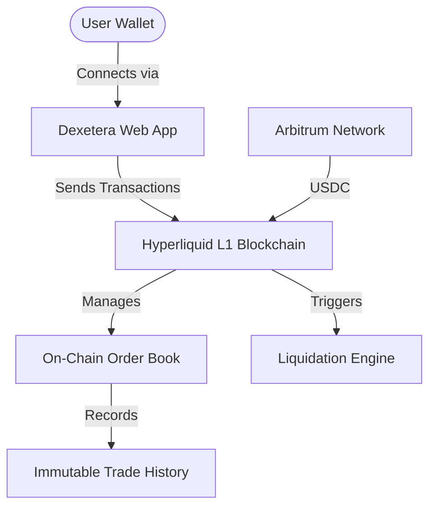
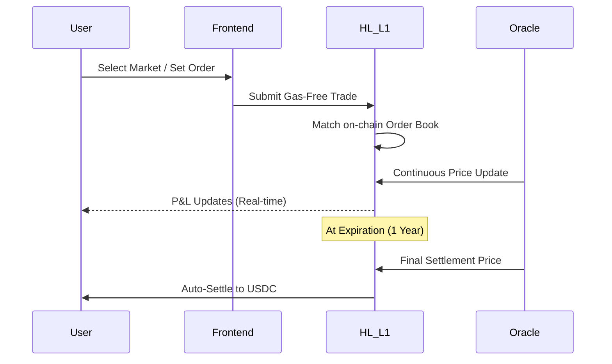
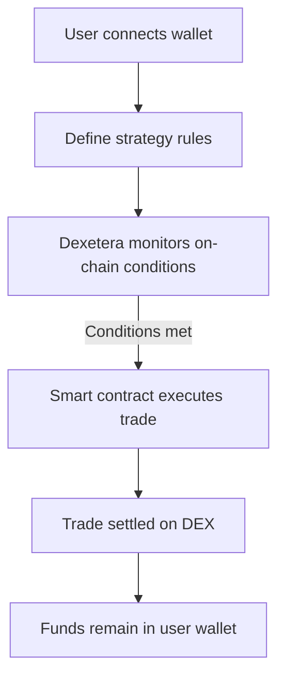
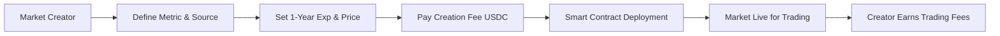

# Dexetera WhitePaper: Trade Anything Measurable

**Date**: February 2026  
**Version**: 1.0  
**Status**: Draft  

---

## 1. Abstract

Dexetera is a high-performance decentralized exchange (DEX) built on the Hyperliquid L1, created and engineered to enable the trading of "anything measurable." 

By abstracting the complexities of blockchain interaction through gas-free, one-click trading and specialized cross-chain infrastructure, Dexetera bridges the gap between the efficiency of centralized platforms and the sovereignty of DeFi. 

The protocol addresses critical issues in the current market, including custody risk, opaque liquidations, and rigid asset selection. Through a permissionless market creation suite, Dexetera lets users create and trade custom futures contracts on any verifiable data source, from traditional crypto assets to local economic metrics. With a robust on-chain order book, a dynamic liquidation engine, and a sustainable fee-based economic model, Dexetera provides an institutional-grade foundation for the next generation of decentralized trading.

---

## 2. Introduction

### The Problem: Limitations of Centralized Systems
Modern financial markets are dominated by centralized exchanges (CEXs) that introduce a layer of counterparty risk and friction. High-frequency traders and retail participants alike face significant hurdles:
- **Custody Risk**: Users must surrender control of their assets to intermediaries, making them vulnerable to exchange insolvency or mismanagement.
- **Opaque Operations**: Order matching and liquidation processes often happen behind closed doors, leading to accusations of market manipulation or unfair front-running.
- **Regulatory Friction & Access**: Geographical restrictions and opaque procedures exclude millions of potential traders from global markets.
- **Limited Market Innovation**: Traditional platforms dictate which assets can be traded, stifling the ability to hedge against hyper-local or unconventional risks.

### Market Gap: The DeFi Alternative
While the DeFi (Decentralized Finance) ecosystem has introduced alternatives like dYdX, GMX, and Hyperliquid's native perpetuals, a gap remains:
- **Rigid Asset Selection**: Existing DEXs primarily focus on top-tier cryptocurrencies, neglecting the long tail of "anything measurable."
- **Gas Fee Volatility**: Many DEXs require users to manage separate gas tokens and navigate fluctuating network costs.
- **User Agency**: No platform yet offers the seamless ability for users to permissionlessly create and trade their own custom futures markets with institutional-grade latency.

### The Thesis: Dexetera's Solution
Dexetera is built on the premise that **if it can be measured, it can be traded.** By leveraging the Hyperliquid L1 blockchain, Dexetera provides a gas-free, one-click trading experience that combines the speed of a CEX with the transparency and self-custody of a DEX. Dexetera empowers users not just as traders, but as market architects, allowing for the creation of immutable, verifiable futures contracts on any data source.

---

## 3. Platform Architecture

### Technical Stack: Hyperliquid L1 & Arbitrum Integration
Dexetera is engineered as a high-performance decentralized protocol utilizing the **Hyperliquid L1**. This specialized blockchain is optimized for an on-chain order book, providing sub-second latency and high throughput. 
- **L1 Performance**: All order matching and settlement occur on the Hyperliquid blockchain, ensuring 100% on-chain transparency.
- **Cross-Chain Bridge**: Users interact with the protocol using USDC on the **Arbitrum network**. A cross-chain infrastructure manages the seamless deposit and withdrawal of funds without requiring users to switch native gas tokens.

### Order Matching & Throughput
The protocol employs a native **Order Book**, which allows for:
- **Price Precision**: Limited slippage and tighter spreads compared to liquidity pools.
- **High Frequency**: Support for thousands of orders per second.
- **Latency**: Near-instant execution, mimicking the feel of centralized trading interfaces.

### Liquidation Engine 
Dexetera operates without leverage, therefore liquidations are only possible for SHORT positions. When a user opens a SHORT position, they are essentially betting that the price of the asset will go down. If the price of the asset goes up more than 100%, the user's position will be liquidated.

### Price System: Verifiable Data Sources
Information integrity is the cornerstone of Dexetera's "Trade Anything" model.
- **Custom Data Sources**: For every market, creators must specify a publicly verifiable data source (URL/API) expiration date.

### System Architecture Diagram

---

## 4. Product Features

### Core Functionality
Dexetera offers a professional-grade suite of trading tools designed for both speed and strategic depth.

| Feature | Dexetera Utility | Benefit |
| :--- | :--- | :--- |
| **Order Types** | Market, Limit, more order types will be added in the future | Precision entry and exit strategies. |
| **Collateral Type** | USDC (Self-Custody) | Stability and ease of account management. |
| **Risk Management** | Stop-Loss / Limit Orders | Automated protection without manual monitoring. |
| **Creation Suite** | User-Generated Markets | Permissionless creation of niche/local markets. |

### Trade Lifecycle Diagram

### UI/UX Differentiators
- **One-Click Trading**: Elimination of repetitive wallet signatures for every order.
- **Gas-Free Experience**: The protocol abstracts blockchain complexity, paying gas fees on behalf of the user to ensure a seamless experience.
- **Custom Views**: Advanced charting and depth visualizations for every market, including user-created ones.

### Custom Market Creation Flow

---

## 5. Economic Model (Fees & Sustainability)

As Dexetera does not currently employ a native utility token, its economic sustainability is driven by a transparent fee structure that ensures platform maintenance and rewards market innovation.

### Fee Structure
| Action | Calculation Base | Logic |
| :--- | :--- | :--- |
| **Opening Trade** | Notional Position Value | Deducted from collateral upon entry. |
| **Closing Trade** | Notional Position Value | Adjusted against final P&L. |
| **Roll-Over** | Notional Position Value | Applied when extending a 1-year contract. |
| **Market Creation** | Flat USDC Fee | One-time cost to initialize a new custom market. |

### Revenue Distribution
The fees collected by the protocol are architected to support the ecosystem:
1. **Protocol Treasury**: Funds continuous development, L1 validator costs, and infrastructure.
2. **Market Creator Rewards**: A portion of trading fees from user-created markets is directed to the original creator, incentivizing the onboarding of high-quality, unique data feeds.

---

## 6. Security & Risk Management

### Smart Contract Integrity
- **Audit Framework**: Dexetera enters the market with a "Security-First" approach. Smart contracts are subject to rigorous internal testing and scheduled third-party audits (Planned for Q2 2026).
- **Open Source**: The protocol's codebase is public and verifiable, allowing for community-driven bug bounties and independent verification of all logic.
- **Withdrawal Transparency**: Since all funds are in USDC and self-custodied via smart contracts on Hyperliquid, users can always track their bridge-out status on-chain.

---

## 7. Roadmap

Dexetera follows a phased development cycle focused on stability before expansion.

### Phase 1: Foundation (Q1 - Q2 2026)
- [x] Initial Core Protocol Deployment on Hyperliquid Testnet.
- [ ] Beta User Onboarding & Feedback Loop.
- [ ] Completion of External Smart Contract Audits.
- [ ] Mainnet Launch (Initial list of 20+ markets).

### Phase 2: Expansion & Tooling (Q3 - Q4 2026)
- [ ] **Advanced Features**: Implementation of trailing stops and multi-collateral support (if applicable).
- [ ] **Market Creator Studio**: Enhanced UI for one-click creation of complex futures contracts.
- [ ] **Mobile Integration**: Launch of a high-performance progressive web app (PWA) and dedicated mobile interface.

### Phase 3: Decentralization & Ecosystem (2027+)
- [ ] **Governance Alpha**: Transitioning protocol parameters (fee levels, market listings) to a decentralized voting mechanism.
- [ ] **SDK / API Access**: Allowing institutional partners and algorithmic traders to build directly on top of Dexetera's infrastructure.
- [ ] **Cross-Chain Expansion**: Integration with additional Layer 2 networks for collateral deposits.

---

## 8. Team & Advisors

Dexetera is developed by a global collective of engineers and financial technologists committed to the principles of decentralization and financial sovereignty.

### Background
The core development team consists of veterans from the blockchain and high-frequency trading sectors, with prior experience at major DeFi protocols and traditional financial institutions. 

### Accountability & PSEUDONYMITY
While some team members operate under pseudonyms to align with the cypherpunk roots of the DeFi ecosystem, accountability is maintained through:
- **On-Chain Track Record**: Proof of work via public GitHub contributions and previous protocol deployments.
- **Transparent Governance**: A commitment to transitioning all critical protocol decisions to a decentralized autonomous structure.

---

## 9. Legal & Compliance

### Jurisdictions & Restrictions
Dexetera is a decentralized protocol. Access to the frontend interface may be restricted in certain jurisdictions based on local regulatory frameworks. Users are responsible for ensuring their participation complies with the laws of their respective regions.

### Regulatory Stance
The protocol is designed as a technological primitive for decentralized trading. Dexetera does not issue a native security token. All fees are transaction-based utilities intended for protocol sustainability and infrastructure maintenance.

### Disclaimer
Trading cryptocurrencies and futures involves significant risk of loss and is not suitable for every investor. The valuation of futures contracts may fluctuate, and as a result, clients may lose more than their original investment. Dexetera is provided "as is" without warranties of any kind. 

---

## 10. Conclusion

Dexetera represents a new innovative option for decentralized trading. By moving beyond the limitations of centralized intermediaries and the rigidity of early-stage DEXs, we have created a platform that is fast, transparent, and truly permissionless. 

Whether you are a professional trader seeking institutional-grade latency or a market architect looking to create exposure for niche metrics, Dexetera provides the tools to trade anything measurable.

### Call to Action
- **Join the Waitlist**: Be among the first to experience gas-free trading on Mainnet.
- **Join the Community**: Participate in discussions on Discord and Twitter to help shape the future of the protocol.
- **Build with Us**: Explore our open-source repositories and start architecting your own markets today.

**Dexetera: Trade Anything, Anywhere.**
